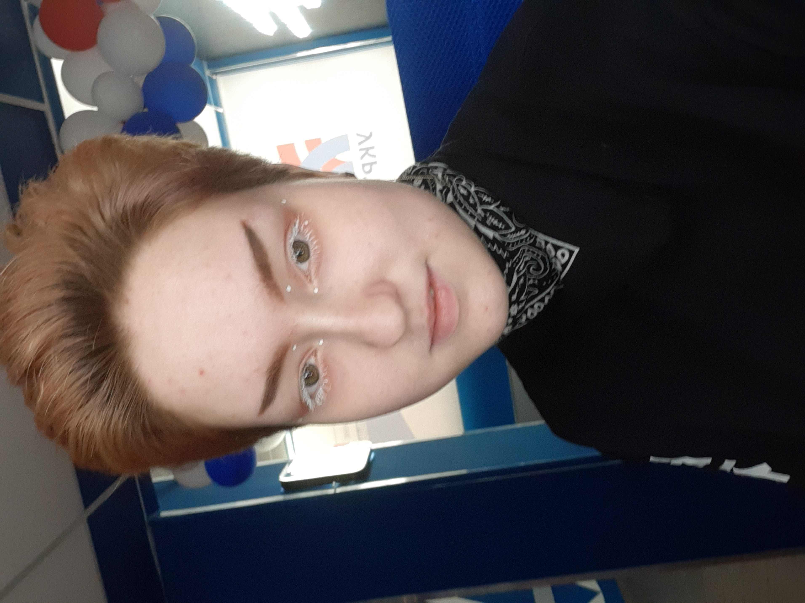

> # Рената Исламгулова

По данному [тесту личности](https://www.16personalities.com/ru) я [Стратег](https://www.16personalities.com/ru/lichnost-intj "чета не виднааа")

> ### Личные данные

Дата рождения: 07.11.2002

Почта: ren.isla@yandex.ru

> ### Образование

В данный момент получила среднее образование, получаю средне-специальное в Уфимском колледже радиоэлектроники по специальности информационные системы и программирование по направлению 1С.

> ### Опыт работы

По специальности не имею. 

> ### Навыки

Итак, по навыкам всего понемногу:

+ Python (минимально)
+ C# (неменого)
+ минимально работала с git
+ что-то делаю в Android Studio
+ HTML (минимально)

Ранги: минимально -> немного -> знаю

> ### Увлечения

Люблю лежать, читать фэнтези, играю  в Genshin Impact, читаю мангу и смотрю аниме. 
> ### О себе

Итак, погнали.

Родилась и жила в Уфе. Училась в школе не очень (на тройки), но к 8 классу стала хорошисткой ибо появилась цель — поступить на программиста (которую я достигла).

Именно поэтому я и пишу это сейчас — мне нужна цель чтобы появилось желание что-то делать.

Ну, что же давайте по порядку. Я человек не привыкший к общению с незнакомыми и малознакомыми людьми мне всегда было трудно начинать разговор. Я всегда была тихоней - паинькой.
Мне это не нравилось и я пыталась это изменть, но у меня не получалось. Уже давно я поняла, что из-за этого жизнь проходит мимо меня.

Все заканчиваетя и эта стадия тоже закончилась. В итоге мы получаем нынешнюю версию меня, начну описание. За последние пол года моя жизнь сильно поменялась, из привычно пассивного и уставшего человека я стала (нет, не активной и жизнерадостной) более энергичной и живой. 
Это благодаря общеню с хорошими людьми и небольшой подработке этим летом (я была оператором аттракцинона, это была очень общительная и ответственная работа). 
Сейчас я хочу и дальше менять свою жизнь, именно для этого я здесь.

В итоге я ответственный человек, который готов менять свою жизнь и обучаться новому. Благодарю за внимание.
